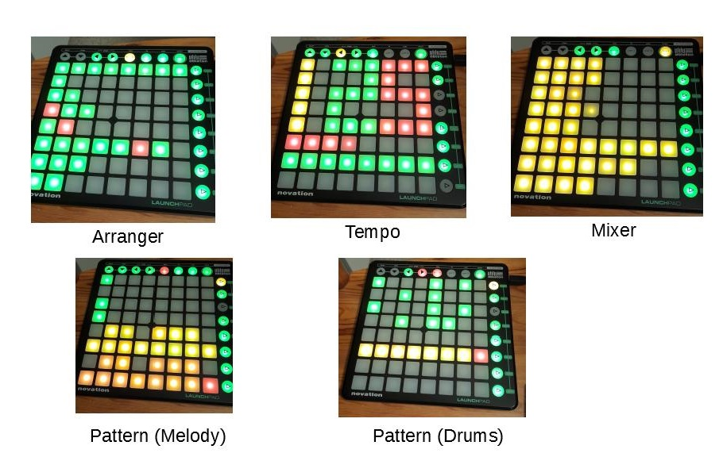

# svseq

`svseq` is a simple pattern based step sequencer built around the [Novation Launchpad MK1](https://resource.novationmusic.com/support/product-downloads?product=Launchpad+MK1) and the [Sunvox sound engine](https://www.warmplace.ru/soft/sunvox/). It supports the [Ableton Link protocol](https://www.ableton.com/de/link/) and will synchronize automatically with other Link enabled applications.

## Screenshots

## Prerequisites

- [Python 3.9](https://www.python.org/downloads/)
- [Poetry](https://python-poetry.org/)
- [CMake](https://cmake.org/)

## Build

    git clone --recurse-submodules https://gitlab.com/hwestphal/svseq.git
    cd svseq
    poetry install
    (cd audio && poetry run python setup.py build_ext --inplace)

## Prepare instruments

Put your melody and percussion instruments as `.sunsynth` files at `./instruments`.

All instruments should be bundled as meta-modules exposing appropriate controls (no. 6 to 9). Percussion instruments will be played at note C3, C4 up to C9.

## Run

    poetry run python main.py
